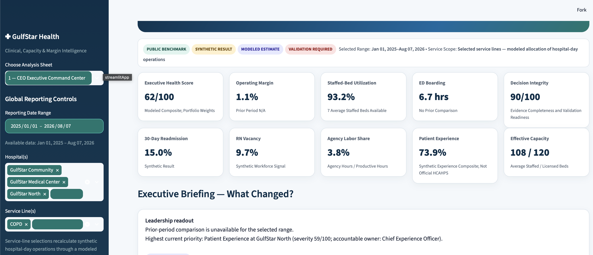
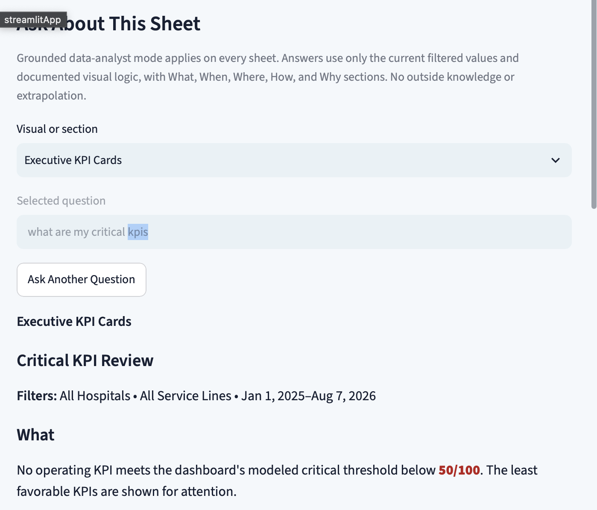

# Healthcare Intelligence Command Center

An executive healthcare analytics portfolio built for a fictional three-hospital Houston health system. The application connects clinical quality, patient flow, effective capacity, workforce, access, margin, equity, privacy, quality improvement, and intervention economics in one auditable Streamlit decision-support product.

## Executive-first architecture

The first two analysis sheets are designed as operating command centers rather than traditional reporting pages:

1. **CEO Executive Command Center**
   - Executive Health Score with transparent portfolio weights
   - Current vs comparable prior-period "What Changed?" briefing
   - Hospital/domain Executive Priority Queue
   - Accountable executive ownership (COO, CNO, CMO, CFO, etc.)
   - Modeled financial exposure paired with evidence labels
   - Effective staffed capacity, RN vacancy, agency labor, and patient-experience signals
   - Explicit distinction between synthetic results, modeled estimates, and validation-required conclusions

2. **Patient Flow & Capacity Command Center**
   - Licensed vs staffed vs occupied capacity
   - Available staffed beds
   - ED boarding and ED-to-provider intervals
   - Pending admissions and expected discharges
   - Discharge-order-to-exit delay
   - Hospital operating matrix
   - Modeled patient-flow funnel
   - What-if bed-day release scenario

The application contains 17 analysis sheets in total, including dedicated demonstrations of:

- Clinical deterioration and rescue surveillance
- Preventable harm and modeled financial exposure
- Readmission prevention and transition reliability
- Workforce-to-outcome analytics
- Access leakage and lost demand
- OR and procedural yield
- Health equity screening and geographic opportunity
- Payer, denial, and margin integrity
- Intervention prioritization and ROI modeling
- Methods, governance, evidence confidence, and lineage
- CIPP-informed privacy governance and responsible analytics
- CPHQ-informed statistical process control, Pareto prioritization, PDSA learning cycles, and reliability management
- **Ask GulfStar Intelligence**, a deterministic natural-language Q&A layer over the active dashboard filters
- **Census Forecasting & Model Validation**, a real offline Ridge forecasting model with time-aware backtesting and prediction intervals
- **CMS Real-Data Model Audit**, a grouped and calibrated classifier built from official public CMS hospital data

## Census forecasting ML

Analysis Sheet 16 forecasts synthetic hospital census 30 days ahead for capacity and staffing scenario planning. The committed model is a Ridge regression using hospital and weekday indicators, time trend, annual terms, census lags at 1/7/14/28 days, and trailing 7/28-day means. It is trained offline from `data/daily_operations.csv.gz`; Streamlit loads the committed artifact and never retrains during an end-user session.

**Decision and cost of error:** the target is daily occupied census because hospital leadership must decide whether ordinary staffed capacity is sufficient or whether a validated contingency review is needed. Underforecasting is operationally more consequential than overforecasting: as an explicit illustrative portfolio assumption, a 10-bed one-day miss could require 120 unplanned nursing hours, and at $76 per hour that is $9,120 before other labor or capacity costs. The dashboard does not treat that assumption as a public benchmark; a real health system must replace it with approved staffing ratios, wage premiums, skill mix, and policy constraints.

Validation uses six rolling-origin folds with a 30-day recursive horizon and reports a naive random split only as a contrast. Ridge achieved **6.23 beds MAE**, compared with **5.77** under the optimistic random split, **8.48** for the seven-day seasonal-naive baseline, and **6.26** for gradient boosting. The pre-registered decision rule adopts gradient boosting only if it reduces rolling-origin MAE by at least 5%; it did not, so Ridge remains selected. Rolling-origin fold MAE ranges from **5.81 to 6.86 beds**.

Uncertainty is calibrated separately for days 1–7, 8–21, and 22–30. The radii are **±15.34**, **±12.76**, and **±14.31 beds**, with overall bucket-calibration coverage of **90.2%**. Sequential earlier-fold coverage is also disclosed and is lower for some buckets; the staffing/capacity callout therefore reports the complete interval and requires operational validation before action. Error is nearly horizon-invariant in this simulation, which is documented as a synthetic-generator artifact that should not be assumed in real deployment.

Rebuild the committed artifacts with `python ml/train_census_forecast.py`. The model, backtest predictions, 30-day forecast, metrics, and model card are stored in `ml/artifacts/`. These are synthetic-data validation results, not evidence of performance on a real health system; prospective external validation is required before operational use.

## CMS real-data model

Analysis Sheet 17 uses **2,620 real CMS hospitals across 51 states/DC**. `etl/fetch_cms.py` paginates the official Provider Data Catalog API for Hospital General Information, HCAHPS hospital star measures, and the Hospital Readmissions Reduction Program. It records retrieval time, dataset IDs, source dates, row counts, and SHA-256 hashes in `data/cms/manifest.json`, then builds one hospital-level feature table.

The model estimates whether a hospital's mean reportable HRRP excess readmission ratio is above 1.0 from published ownership, service, reporting-breadth, and HCAHPS attributes. Five outer folds hold out complete states; nested grouped predictions calibrate probabilities with isotonic regression. The grouped calibrated AUC is modest and the Brier score improves only slightly over a prevalence-only baseline: patient-experience and structural features carry a weak but nonzero association signal, while most variance remains unexplained. Grouped and stratified comparisons now use identical five-fold out-of-fold pipelines differing only in the splitter, with bootstrap intervals shown for both.

This is deliberately framed as a cross-sectional public-data association classifier. The HRRP outcome period predates the current HCAHPS snapshot, so it is not a prospective readmission forecast. It must not be used for patient-level prediction, hospital ranking, payment, contracting, quality judgment, or care decisions. The app provides a search-by-hospital validation lookup rather than a leaderboard, displays probability beside model uncertainty, and states that CMS measures are authoritative. Isotonic calibration did not improve Brier score at displayed precision and slightly reduced AUC; that negative result is disclosed directly.





## Reproducibility

From a fresh clone, install `requirements-lock.txt`, then run `make data && make train && make test`. This retrieves the official CMS sources, rebuilds both model families, and runs the full validation suite. `make train` never runs inside Streamlit. GitHub Actions uses the same pinned environment and repeats offline training and tests on pushes and pull requests. Human-readable metrics and forecasts are written at stable precision; source extracts use deterministic gzip output.

## Ask GulfStar Intelligence

Analysis Sheet 15 lets an end user ask supported plain-language questions without an external LLM, paid API, or API key. The local query layer maps intent and metric synonyms to an allowlist of pandas aggregations. Every answer displays:

- The direct answer and supporting hospital values
- The calculation or metric definition used
- The evidence type (Synthetic Result, Modeled Estimate, or Validation Required)
- A limitation statement and visible synthetic/no-PHI/not-patient-care guardrails

Supported intents include dashboard overview/help, hospital comparisons, highest/lowest metrics, current-period values, comparable prior-period changes, last-N-day changes within the selected date range, intervention ROI, executive priority rationale, modeled priority exposure, positive-change summaries, negative-change summaries, executive summaries, and trend summaries. Executive language includes “Tell me about this dashboard,” “What can I ask?”, “What improved?”, “What got worse?”, “Give me the good news,” “What changed this month?”, “What should the CEO know?”, and “What should leadership celebrate?” Supported measures include readmission, mortality, falls, HAI, ED boarding, ED-to-provider time, LWBS, staffed-bed utilization, available staffed beds, RN vacancy, agency labor share, patient experience, operating margin, denials and denial rate, OR utilization, and specialty wait.

Broad executive summaries default to the latest 30 filtered days compared with the preceding 30 filtered days. Explicit “last N days” questions use two equal N-day windows. Direction is determined from each metric’s documented higher/lower-is-better rule; values that round to no displayed change are labeled stable. Because dollars, counts, hours, days, and rates cannot be ranked directly, cross-metric summaries rank movements by proportional change.

Hospital and date filters apply to all Q&A results. The service-line filter applies to encounter-based readmission answers. Intervention scenarios are system-level modeled inputs and therefore do not change with hospital, service-line, or date filters. Unsupported or ambiguous questions are refused with examples rather than guessed.

### Contextual visual Q&A on every sheet

Each analytical sheet, including the forecast-validation sheet, includes a floating **Ask this visual** control. It remains fixed at the bottom center while the dashboard scrolls, avoiding Streamlit Cloud's lower-right management badge. The closed state is a small pill that does not interrupt the page layout; clicking it opens a compact, independently scrollable popover. The user selects the visual or section currently in view and can immediately ask:

- What is this visual telling me?
- What happened on this visual?
- What should I focus on, and why?
- What can I do to improve this result?
- What are the callouts or warnings?
- How is this calculated or encoded?
- What are the limitations?

Both the floating assistant and the dedicated Q&A sheet operate under one grounded data-analyst contract. Every rendered answer uses explicit **What**, **When**, **Where**, **How**, and **Why** sections. The When and Where sections are generated from the active date, hospital, and service-line filters; How identifies the predefined calculation or documented visual logic; Why explains why the descriptive conclusion follows from the shown figures while refusing to invent an unobserved cause. A visible constraint states that only filtered dashboard values and documented logic may be used, with no outside knowledge or extrapolation.

The **Why** section is evidence-based rather than a generic caveat. Structured visual answers use their specific arithmetic, ranks, component scores, or comparison facts; other visual answers build Why from the displayed supporting points. Causal, clinical, and validation boundaries remain visible separately as limitations.

The contextual catalog covers 26 visuals and sections across all 14 analytical pages. Granular interpretation is a dashboard-wide rule: when a user names content visible in the selected visual, the assistant explains that specific KPI, axis, score, table field, modeled input, callout, or governance component rather than repeating the entire visual description. Safe data-backed measures return the current filtered value, definition, hospital variation, calculation, evidence type, and metric-specific limitation. Modeled and documented content—including priority severity/exposure, funnel stages, outcome pressure, intervention value/cost/capacity/confidence/ROI, portfolio budget selection, evidence-readiness components, source registry fields, privacy exposure/severity, control limits, Pareto counts, and PDSA stages—returns its exact deterministic visual logic and appropriate evidence label. Improvement responses are predefined validation and process-improvement options—not generated clinical recommendations. Unsupported questions are refused rather than guessed.

Improvement questions are metric- and filter-aware. A request such as **“How can I improve the ER boarding?”** recognizes ER as ED, reports the current filtered value and threshold gap, identifies the hospital with the strongest pressure, brings in related filtered guardrails, assigns the appropriate executive role, and provides a validation-first time-bounded response sequence. A general question such as **“How can we improve this visual?”** selects the weakest safely scored metric within that visual. Recommendations remain predefined operating and validation pathways; they do not assert causality or prescribe patient care.

Composite and modeled visuals use the same contract. Their component measures are exposed to the improvement router, so **“How can I improve patient experience?”** on Executive Health Score by Domain follows the Patient Experience pathway instead of returning generic composite-score advice. Non-metric content has its own deterministic pathway for priority severity/exposure, intervention assumptions, evidence readiness, source lineage, privacy exposure, governance gates, SPC limits, Pareto barriers, and PDSA learning stages.

Composite-score answers explicitly reconcile display and source scales. For example, the Patient Experience bar may display **63/100** while the underlying filtered synthetic Patient Experience KPI is **76.8%**. The answer leads with the displayed 63/100, names the 76.8% input, and explains that the modeled score normalizes the KPI between illustrative lower and favorable references; the values are not presented as interchangeable.

Questions that name an Executive Health Score domain are resolved before similarly named metric aliases. For example, **"Why is Access so low?"** explains the displayed Access score and rank, then shows the raw LWBS and Specialty Wait values, their normalized component scores, and the unweighted domain calculation. The same domain-level pathway applies to Quality & Safety, Patient Flow, Financial, Workforce, and Patient Experience.

Multiple domains can be named in one question. For example, **"Why are Access and Patient Experience so low?"** returns both displayed scores and ranks, every underlying component, each normalized calculation, their position against the other domains, and the point difference between the two named domains. The router does not stop after the first matched domain.

Multi-domain titles preserve the order in which the user named the domains and reflect whether the question asks why scores are high, low, or different. Rank and tie language uses the whole-number precision displayed in the chart; domains that both display 90/100 are reported as tied even if hidden decimals differ slightly.

The visual catalog also serves as an executable semantic contract. Every visual title is tested with punctuation and natural wording variants; every mapped metric is tested through all registered aliases wherever it appears; and every documented modeled or governance term is tested through all of its visible-name variants. Exact content documented for the selected visual takes precedence over broad dashboard synonyms, preventing a phrase such as **financial exposure** on the Priority Queue from being interpreted as Operating Margin. Every registered visual must include purpose, focus, action, callout, calculation, limitation, and a metric or documented-content mapping.

Contextual answers use an executive-readable layout rather than a dense paragraph. Improvement results show a short direct answer, a **What matters** bullet list, a numbered **What leadership should do** list, and one concise caution. Active filters are not repeated in the narrative because they remain visible on the dashboard. Evidence type, calculation, and the full limitation are available in a collapsed **Evidence, calculation, and limitations** section.

The selected scope appears once as a compact bold **Filters:** line. Full selections are summarized as **All Hospitals** and **All Service Lines**; subsets list only the selected values. Every bullet and numbered action is rendered on its own line with sentence capitalization for CEO-level scanning.

Named-entity position questions are data-aware. A question such as **“Why is GulfStar North so low?”** identifies the hospital in the selected visual, reports its actual plotted values and rank/comparison, explains size or encoding where supported, and separates the descriptive position from causal explanation. The assistant states what the chart shows, what leadership should validate, and what the available data cannot establish.

High, low, average, comparison, and outlier language is handled consistently across metric-backed visuals. On multi-axis charts, each axis is ranked independently, so a hospital can correctly be highest on one measure and in the middle on another. Multi-hospital questions return side-by-side current values and positions. Outlier questions identify relative separation within the selected peer group but do not call a point a statistically confirmed anomaly when the peer set is too small. “Why” answers describe the measured difference and provide validation steps without inventing an operational cause.

General explanation questions on hospital-comparison visuals also enumerate every selected hospital instead of returning only a portfolio average. The Deterioration-to-Harm Reliability Matrix additionally explains both axes and bubble size, reports hospital-level deterioration, harm, and encounter volume, and identifies each hospital's highest combined-pressure service line for validation-first follow-up.

Contextual Q&A state is versioned for Streamlit Cloud deployments. Browser sessions holding older widget or result structures are migrated automatically so a redeploy cannot fail with a stale `visual_qa` key or incompatible saved-result shape.

The footer displays the active dashboard build identifier, allowing the deployed Streamlit instance to be reconciled with the expected release. Both Q&A surfaces include a clear-answer control so a user can discard a persisted response immediately after a semantic or formatting update.

Modeled funnel-stage questions use the actual selected scenario math. Questions about Modeled Delayed Placements report the count, share of admissions, complementary within-target count, boarding-pressure input, formula, and the fact that discharges are a separate operating total rather than the next patient-level subset.

Every displayed funnel stage now has its own interpretation: ED Arrivals, Admissions, Bed Placement Within Portfolio Target, Modeled Delayed Placements, and Discharges. High/low/why questions use the correct count, denominator, evidence label, stage relationship, and cohort limitation instead of returning generic focus guidance.

Monthly chart questions are also resolved against the plotted monthly data. On **Margin and Flow Pressure by Month**, the assistant can calculate the highest Operating Contribution month, the lowest ED Boarding month, or an explicitly defined equal-weight balanced result. Incomplete months are excluded from fair month-total rankings and identified in the answer.

The contextual assistant uses a hybrid question flow. Clear requests answer immediately. When wording has multiple materially different meanings, it pauses before calculation and presents a short set of visual-specific interpretations. For example, **“What is my best month?”** offers highest Operating Contribution, lowest ED Boarding, or the best disclosed balance; the user selects the intended decision lens and receives that calculation. Unsupported language continues to use similarity-ranked safe suggestions.

The visual semantic layer also supports reusable ranking and aggregation rather than one-off phrases. On the Executive Health Score visual, users can request the average across all domains, the highest or lowest domain with displayed ties preserved, or the arithmetic average of any explicitly named two, three, or larger set of domains. Across metric-backed visuals, explicitly named measures can be ranked or averaged by hospital and, where the underlying encounter data support it, by service line, payer, discharge barrier, or day of week. Measures with incompatible units are never silently combined; the assistant asks the user to choose the intended measure.

Multi-item improvement and comparison questions use the same semantic layer. Users can ask how to improve one or several named domains or measures, why one score is lower or higher than another, or how a lower domain could move toward a higher comparison. The answer quantifies each score and gap, lists the underlying measured components, identifies the lowest modeled component, and provides a separate accountable validation-first pathway for every named item. Questions using causal language are answered as measured-driver explanations: component arithmetic can explain why the displayed score has its mathematical position, but the assistant explicitly refuses to label those components as proven operational causes without validated local evidence.

Named-item requests are not capped at three. The parser evaluates every supported domain, metric, hospital, service line, payer, barrier, or applicable time group explicitly present in the question. Four-, five-, and six-domain requests and four-or-more-metric improvement requests use the same calculation and response contract. The three-item limit applies only to closest-match recovery suggestions, where a short list is intentional; it never truncates entities the user actually named.

Low modeled scores are visually prioritized for executive review. Any score below 80/100 is rendered in bold red in KPI cards and contextual Q&A answers, including supporting score callouts. This presentation rule applies only to explicit 0–100 scores; it does not recolor percentages, hours, counts, dollars, or other measures whose favorable direction and thresholds differ.

Ranking questions are quantity-aware across the semantic catalog. Requests such as `best two months`, `top 3 domains`, `lowest five service lines`, or `highest 2 hospitals` return the requested number of ranked results rather than a single extreme. Numeric and written counts are supported, clarification choices retain the requested quantity, and ties at the cutoff are preserved and disclosed. Metric names such as `30-Day Readmission` are protected from being misread as a request for 30 results.

### Service-line filter behavior

The service-line control now recalculates the operational dashboard, not only encounter-based readmission results. Because the source operations table is hospital-day grain, the app uses a deterministic synthetic allocation layer for service-line capacity, demand, census, flow intervals, quality events, staffing, labor, experience, procedural activity, revenue, cost, and denials. Selecting all service lines reconciles exactly to the original hospital-day portfolio; selecting a subset rolls only those modeled service-line components back into the KPI cards and visuals. The evidence bar labels this scope as a **Modeled Estimate**. Privacy events, source-governance facts, and intervention assumptions do not contain defensible service-line attribution and are explicitly labeled as not applicable rather than being silently changed.

The floating interaction is responsive: desktop popovers are capped at 430 pixels wide and 76% of viewport height, while the launcher uses tighter mobile spacing. The dedicated Ask GulfStar sheet remains available for broader cross-dashboard questions.

The closed launcher uses a translucent, blurred glass treatment so underlying visuals remain visible. Hovering increases contrast slightly, and opening the popover changes the launcher to solid green to communicate its active state.

Visual explanations are data-aware where a deterministic interpretation is defined. For example, the Executive Health Score by Domain answer reads the six current bars, names the leaders and weakest domain, quantifies the point gap, connects the scores to current filtered component metrics, and explains that the 0–100 value is a normalized modeled distance—not a percent success or failure.

The local language layer normalizes conversational variants, common misspellings, shorthand, tense changes, and chart synonyms without an external model. For example, “anything gud or positve,” “what is not working,” “any red flags,” “how can we make this better,” “why should I care,” “what stands out,” and “how did you get this number” map to distinct safe intents. Retrospective positive/negative questions use the latest 30 filtered days versus the preceding 30 days when the selected visual has a direct metric mapping; forward-looking improvement questions return predefined process and validation options.

When intent remains uncertain, the dashboard no longer stops at a generic refusal. It displays the meaningful keywords it extracted, ranks three close supported questions from a safe allowlist, and provides an **Ask Selected Suggestion** control. The end user—not the parser—chooses whether to run the proposed interpretation. Suggestions are ranked by normalized token overlap, cautious typo handling, phrase similarity, and shared dashboard-domain concepts; they never create arbitrary executable queries.

## Evidence model

Every dashboard conclusion is identified as one of four types:

- **Public benchmark:** authoritative source or metric definition.
- **Synthetic result:** reproducible fictional hospital or encounter data.
- **Modeled estimate:** scenario calculation, not an observed outcome.
- **Validation required:** a decision that needs operational, clinical, financial, legal, privacy, or equity review.

The fictional system and synthetic records prevent disclosure of protected health information. This portfolio is not patient-care decision support.

### Important scoring note

The Executive Health Score, priority severity scores, and portfolio targets are **illustrative decision-support constructs**, not validated clinical scores or external performance benchmarks. A production implementation would require locally approved target definitions, certified measures, prospective validation, governance approval, and accountable executive/clinical ownership.

## Synthetic operating signals

The fixed-seed generator includes:

- Licensed and staffed beds
- Census, admissions, discharges, expected discharges, and pending admissions
- ED arrivals, boarding, ED-to-provider time, LWBS, and specialty wait
- Discharge-order-to-exit delay
- Readmission, mortality, falls, and HAI signals
- RN vacancy, productive hours, overtime, and agency hours
- Synthetic patient-experience composite
- OR cases and utilization
- Revenue, cost, and denials
- Synthetic encounters, transition barriers, SVI quartiles, deterioration, harm, and payer mix
- Synthetic privacy events

## Authoritative sources

- [CMS Provider Data Catalog](https://data.cms.gov/provider-data/topics/hospitals)
- [AHRQ Quality Indicators](https://qualityindicators.ahrq.gov/)
- [CDC/ATSDR Social Vulnerability Index](https://www.atsdr.cdc.gov/place-health/php/svi/)
- [HRSA Area Health Resources Files](https://data.hrsa.gov/topics/health-workforce/ahrf)
- [HHS OCR Breach Portal](https://ocrportal.hhs.gov/ocr/breach/breach_report.jsf)

## Run locally

```bash
python generate_data.py
python -m pip install -r requirements.txt
python -m streamlit run app.py
```

The generated data use a fixed random seed, making the portfolio reproducible. The compressed data can be committed to the repository for fast Streamlit Community Cloud startup without a live API dependency.

## Limitations

- No real patient, claims, staffing, contract, or protected health information is included.
- Synthetic relationships demonstrate analytical workflow and should not be interpreted as causal estimates.
- Financial values are illustrative and do not represent a real health system.
- The patient-experience field is a synthetic portfolio composite and is **not an official HCAHPS score**.
- The modeled patient-flow funnel does not represent observed encounter-level timestamp transitions.
- Public sources are used for definitions and context; the packaged results are not direct hospital rankings.
- Production use would require enterprise data lineage, measure certification, prospective validation, bias review, security assessment, privacy review, and accountable clinical ownership.
